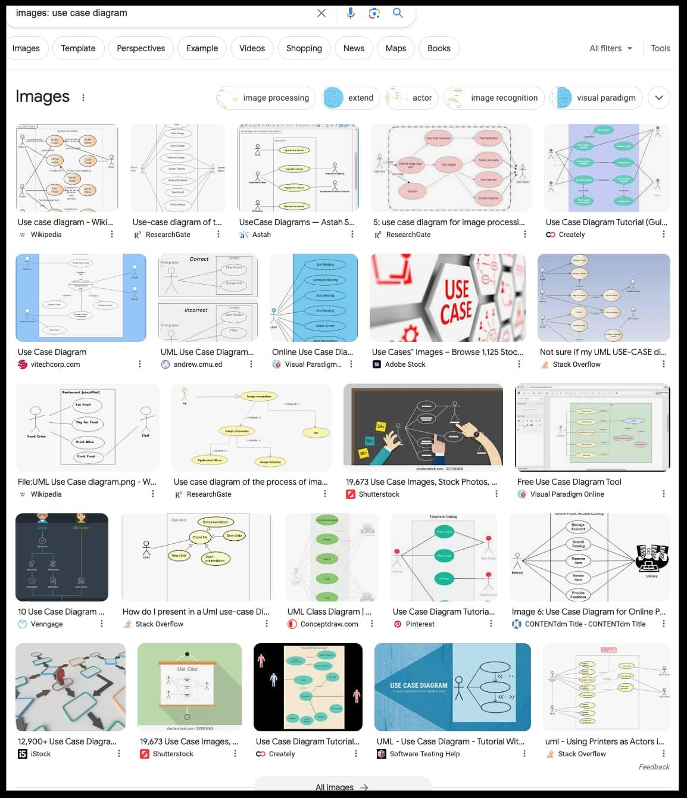

# FAQ for Design & Requirements Documentation

## Glossary

`issue` and `ticket` and `task` and `PR or pull request` may be used interchangeably within this document.

1. [What is our over-riding principle in Springwise Design & Documentation](#what-is-our-over-riding-principle-in-springwise-design--documentation)
1. [Modified CRUD xplainer](#modified-crud-is-the-simple-explanation)

1. [What is Markdown?](#Modified-CRUD-is-the-simple-explanation)
2. [How do I create a hyperlink in Markdown?](#creating-a-hyperlink)
3. [Can I use images in Markdown documents?](#using-images-in-markdown)

---

## What is our over-riding principle in Springwise Design & Documentation?
LiveCoding and checkins constraints include:
- Bursts of effort less than an hour long.
- Untrained (typically) participants in the nature of design & requirements.
- Ideas that don't have time to "percolate" deeply into the coder's understanding.
- A focus on small incremental successes rather than grand accomplishments.

Given these constraints, we attempt to create our designs with extreme simplicity in mind. More is usually less, in this context.

1. Issues or tickets should be very small in scope.
2. The most straightforward tool that works is the best tool for the job.
3. Longer running or more complex designs need to be converted into markdown docs to used to spawn subsequent issues/tickets.

Notice that this "simple" answer already got too complex.

## Modified CRUD is the simple explanation

Our primary form of Design & Requirements is `Modified CRUD`

1. We start with whatever CRUD design we currently have or could have.
2. We modify that to add or fix some simple aspect or feature.

**Example:**
`String foo` becomes `boolean foo` in the table design, and then we make it a checkbox in the `create.html` view. 

**Anti-Pattern:** Proper agile requirements might make this into a user story, and create ERD or UML to document the change, then provide for a test case and or other proper documents as shown below. Nope, we would do none of that, here, if avoidable on the Design and Requirements side.

## When is Modified CRUD not practical within Springwise?

There are times when more complex and difficult to learn documentation stacks are appropriate even for us! But how to know when that is?

## Creating a Hyperlink
To create a hyperlink in Markdown, you use the following syntax: `[link text](URL)`. For example, `[Google](https://www.google.com)` will create a hyperlink to Google with the text "Google".

## Using Images in Markdown
Yes, you can use images in Markdown documents. The syntax is similar to hyperlinks but starts with an exclamation mark. For example, `` where "alt text" is the alternative text for the image, and "image-url.jpg" is the path to your image file.

## When to use an ERD or Entity Relationship Diagram?

In case you've never seen this before, you could always google `images: erd diagram` and get something like this. 

Picture is worth a thousand words. 

In this case, think database schema of Assignment 12. The time when you want to use this is when the tables are already created and functional, and you want to use a tool like MySQL Workbench to reverse engineer into an ERD and allow you to document that part of the design visually.

## When to use a use case diagram?

In case you've never seen this before, you could always google `images: use case diagram` and get something like this. 

Picture is worth a thousand words etc. 

As you can see at quick glance there is no single approach or formula but they all tend to follow a similar flow. 

The most obvious time when we would want to use this to define requirements is when the verbal or words version of an interaction becomes so crazy and difficult that a it would be just easier to show it in a diagram. If it's starting to feel more like `Word Salad` than just `words` maybe one or more use case diagrams would be a better alternative.

We have a number of such situations in Springwise, such as when David Roberts outlines a hard to follow or long winded process for setting up one's LinkedIn for success.

Another situation when it would be easier to use a use case diagram would be when there are multiple types of interactions with one table, each very different. Such as user experience data being a part of turn taking calculations, then much later for building statistics of work completed during LiveCoding sessions. Lotta words.

One last thing: Don't get hung up on tooling, here. There are a huge number of free and/or paid tools available for sketchy stuff like you see below. Perfection is the enemy of good. Just pick one and go with it, export the results to a file and post it in a markdown document such as this one.

