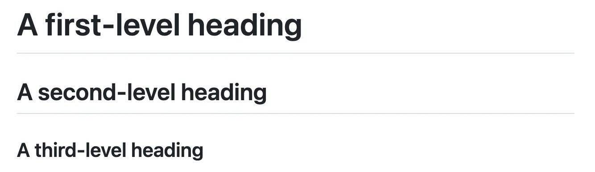
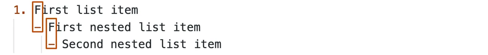
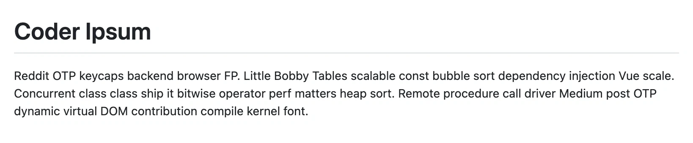

# How to make a document

This is going to show you the basics on how to successfully make a markdown document.

- Start in the **docs** folder.
- Make a file using **upper case snake case** (example below)
  > HOW_TO_MAKE_A_DOCUMENT.md
- Start title with `# Add your title`
- Make sections for each thing `## Section Title Example`
- Use this link for external markdown --> Pete, what was I going to put here?

### Reference the links

- [Wiki Markdown](https://www.markdownguide.org/getting-started/#:~:text=Create%20a%20Markdown%20file%20using,file%20to%20an%20HTML%20document)
- [Markdown Guide](https://en.wikipedia.org/wiki/Markdown)
- [GitHub: Basic writing and formatting syntax](https://docs.github.com/en/get-started/writing-on-github/getting-started-with-writing-and-formatting-on-github/basic-writing-and-formatting-syntax#quoting-text)
- [Another page](RULES.md)

## Headings

To create a heading, add one to six `#` symbols before your heading text. The number of `#` you use will determine the
hierarchy level and typeface size of the heading.

```
# A first-level heading
## A second-level heading
### A third-level heading
```



## Lists

You can make an unordered list by preceding one or more lines of text with `-`, `*`, or `+`.

```
- George Washington
* John Adams
+ Thomas Jefferson
```


To order your list, precede each line with a number.

```
1. James Madison
2. James Monroe
3. John Quincy Adams
```


## Nested Lists

You can create a nested list by indenting one or more list items below another item.

To create a nested list using the web editor on GitHub or a text editor that uses a monospaced font, like Visual Studio
Code, you can align your list visually. Type space characters in front of your nested list item until the list marker
character (`-` or `*`) lies directly below the first character of the text in the item above it.

```
1. First list item                 // No tabs
   - First nested list item        // Tab once, with cursor before the dash
     - Second nested list item     // Tab twice, with cursor before the dash
```



## HTML instead of Markdown

```
<h1>Coder Ipsum</h1>
  <p>Reddit OTP keycaps backend browser FP. Little Bobby Tables scalable const bubble sort dependency injection 
  Vue scale. Concurrent class class ship it bitwise operator perf matters heap sort. Remote procedure call driver
  Medium post OTP dynamic virtual DOM contribution compile kernel font.</p>
```



