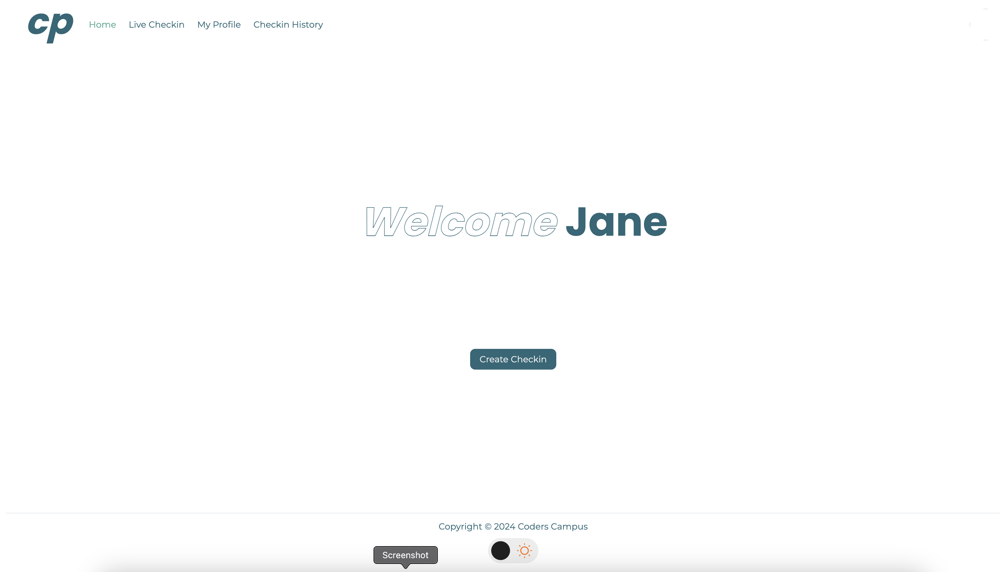
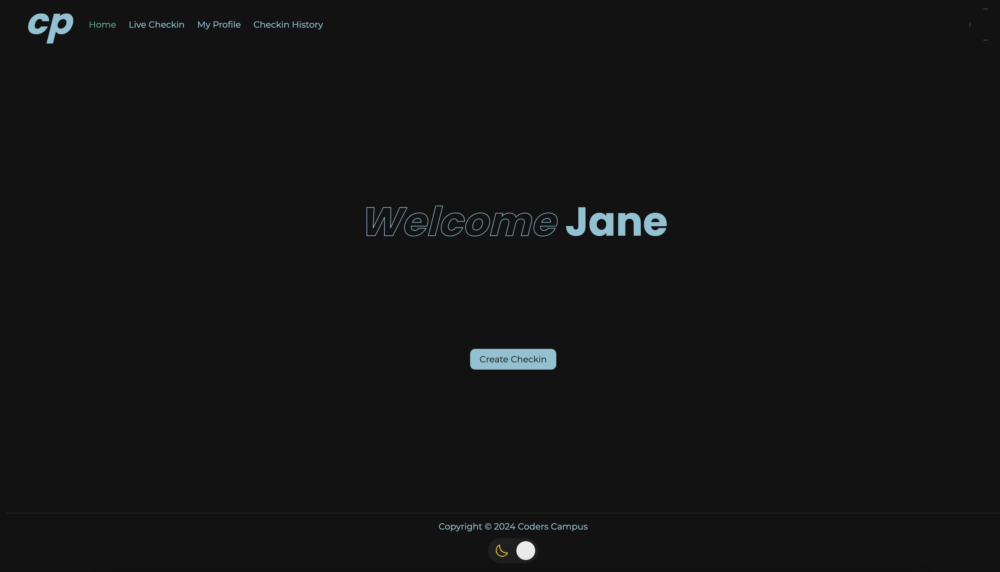
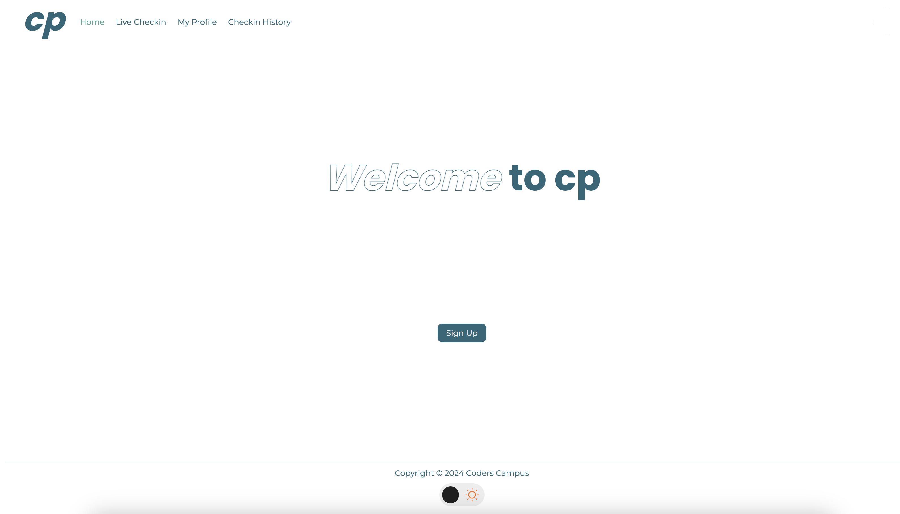
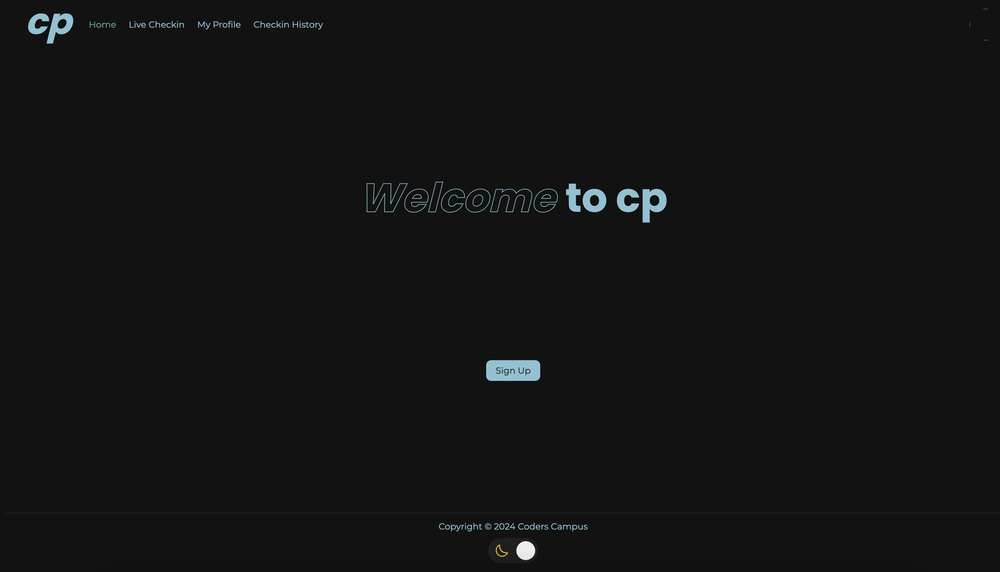
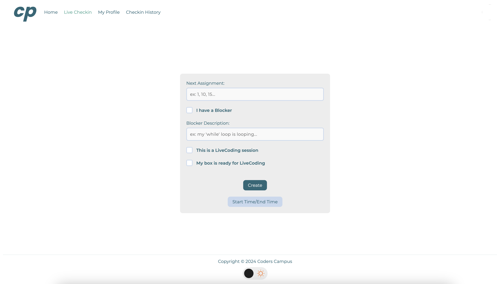
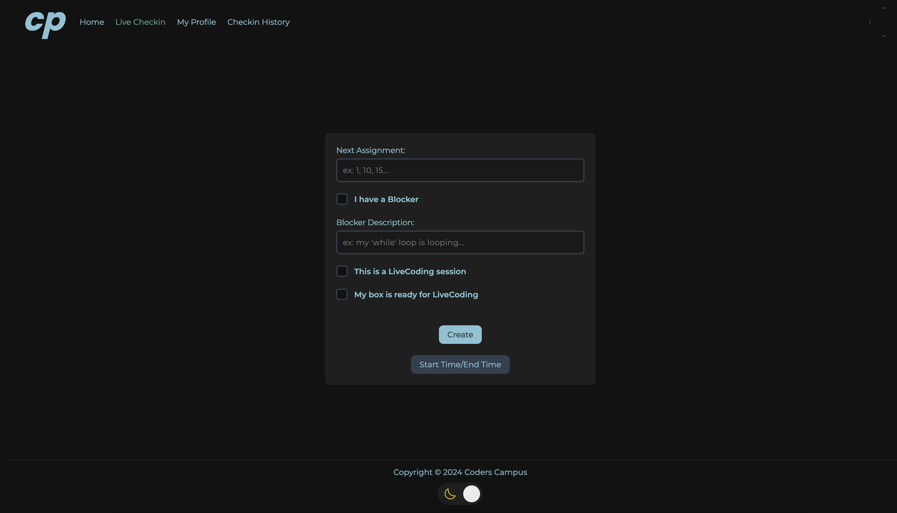
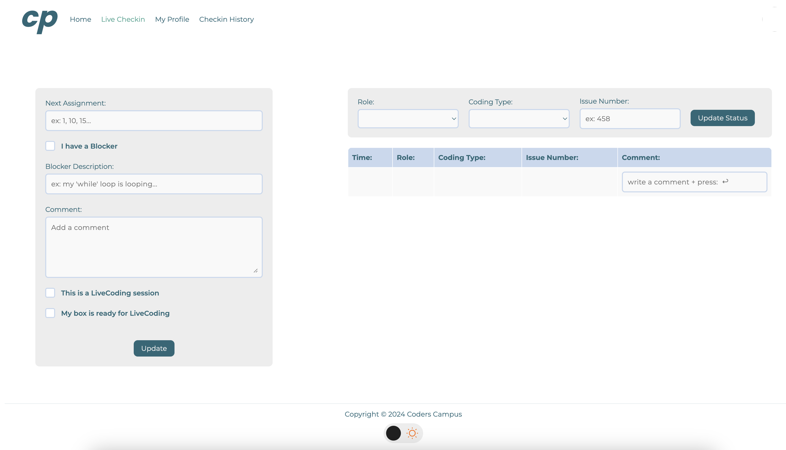
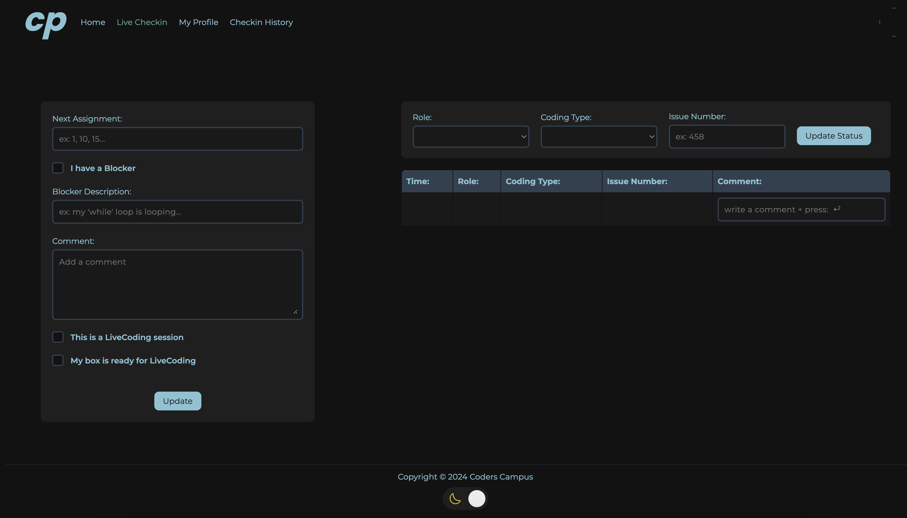

# New UI for Homepage + Checkin features

_04/03/2024 - Kevin Gallaccio_
***

> Please take this doc as a companion for implementing the new UI during LiveCoding   
> Please follow these steps in order.


## Table of content:

- [1. CSS](#css)

- [2. HOME (new /dashboard)](#home)
    * [Visuals](#home-visuals)
    * [Code](#home-code)

- [3. CHECKIN CREATE](#checkin-create)
    * [Visuals](#create-visuals)
    * [Code](#create-code)

- [4. CHECKIN UPDATE](#checkin-update)
    * [Visuals](#update-visuals)
    * [Code](#update-code)

<br>

***
<br>

## CSS

>Before starting to copy/paste the html code, you need to add the following to: `/static/css/uistyle.css` 

```CSS
.big-title {
    display:flex;
    flex-direction: row;
    gap:16px;
    color: var(--primary);
}

.ui-welcome-page {
    display: flex;
    flex-direction: column;
    align-items: center;
    justify-content: center;
    gap: 20px;
    padding: 20px;
    margin: auto;
    height: calc(100vh - 200px);
}

.new-welcome {
    align-items: center;
}

.welcome-button {
    margin-top: 160px;
}

[layout="layout-new"] {
    display: grid;
    grid-template-columns: 1fr 442px 1fr;
    grid-template-areas:
        "margin-top margin-top margin-top"
        "margin-left checkin-start margin-right"
        "margin-bottom margin-bottom margin-bottom";
    grid-template-rows: 1fr auto 1fr;
    height: calc(100vh - 200px);
    margin: 0;
    justify-items: center;
}

.new-form {
    width: 480px;
}

.new-form button {
    align-self: center;
}

.new-form button:first-of-type {
    margin-top: 24px;
}

.ui-checkin-start {
    grid-area: checkin-start;
    border-radius: 8px;
    background-color: var(--background-accent);
}

.ui-checkin-type {
    grid-area: checkin-type;
    border-radius: 8px;
    background-color: var(--background-accent);
}

.ui-checkin-table {
    grid-area: checkin-table;
    width: 100%;
}

[layout="layout-live"] {
    display: grid;
    grid-template-columns: 1fr minmax(100px, 482px) 1fr minmax(100px, 858px) 1fr;
    grid-template-rows: 1fr 100px 20px auto 1fr;
    grid-template-areas:
        "margin-top margin-top margin-top margin-top margin-top"
        "margin-left checkin-start gap-v checkin-type margin-right"
        "margin-left checkin-start gap-v gap-h margin-right"
        "margin-left checkin-start gap-v checkin-table margin-right"
        "margin-bottom margin-bottom margin-bottom margin-bottom margin-bottom";
    height: calc(100vh - 200px);
    margin: 0;
    justify-items: center;
}

.horizontal-form {
    display: flex;
    flex-direction: row;
    align-items: center;
    justify-content: flex-start;
    padding: 16px 20px;
    width: 858px;
    flex-wrap: wrap;
}

.horizontal-form button {
    align-self: flex-end;
    margin-bottom: 6px;
}

.ui-horizontal-input-field {
    min-width: 25%;
    position: relative;
    display: flex;
    flex-direction: column;
    align-items: flex-start;
    justify-content: flex-start;
    gap: 4px 0;
    text-align: left;
    font-size: 14px;
    color: var(--primary);
}
```
***

## HOME

> /home is meant to replace /dashboard.   
> I tried simplifying the UI and have two different versions for **known users** and **new users**

<a id="home-visuals"></a>
### Visuals:

>if student is returning:




>if student is new:




<a id="home-code"></a>
### Code:

>Please Replace **lines 8 through 25** of the `dashboard.html` file    
>_(on `<div class="ga-content-main">` and below)_
>

```HTML
<main class="ui-welcome-page">
                <div class="big-title">
                    <div class="display-small-bold-italic">Welcome</div>

<!--                Create logic If student does not exist + fetch student first name-->
                    <span class="display-small-bold">
                        Jane
                    </span>

<!--                Create logic If student does not exist-->
                    <span class="display-small-bold">to cp</span>
                </div>

<!--                Create logic if student exists-->
                <button class="ui-button welcome-button" ><a href="create.html">Create Checkin</a></button>
                
<!--                Create logic if student does not exist-->
                <form method="post" action="/student/create" class="ui-form new-welcome">
<!--                I changed the above action, please check if it does not break-->
                    <input name="uid" type="hidden" id="uid"/>
                    <div class="mb-3">
                        <input class="form-control" type="hidden" id="display-name"
                               th:field="${student.name}"/>
                    </div>
                    <div>
                        <button class="ui-nav-item ui-button welcome-button" onfocus="assignUid()"
                                type="submit"><span>Sign Up</span></button>
                    </div>
                </form>
            </main>

```
> #### Techincal Debt:
>  . **Make sure to check every single thymeleaf field.**   
> . The `th:if` methods for "if new student" / "if returning student" need to be implemented  


***

## CHECKIN CREATE

> Checkin Create is the entry to Live Checkin   
> Comment section has been removed to go into Activity    
> I chose to remove the "I am ready/available for LiveCoding"   
> _feel free to adjust the features_

<a id="home-visuals"></a>
### Visuals:






<a id="home-code"></a>
### Code:

>Please Replace **lines 8 through 95** of the `checkin/create.html` file    
>_(on `<div layout="layout-sidebar">` and below)_


```HTML
    <div layout="layout-new">
        <div class="ui-checkin-start">
            <main>
                <form method="post" class="ui-form new-form" action="/checkin/create">
<!--                    NEEDS TO REDIRECT TO CHECKIN/UPDATE-->

                    <input name="uid" type="hidden" id="uid"/>
                    <div class="ui-input-field">
                        <label class="ui-label">Next Assignment:</label>
                        <div class="ui-text-input">
                            <input class="ui-value" type="number" placeholder="ex: 1, 10, 15..."
                                   th:field="${checkin.nextAssignment}"/>
                        </div>
                    </div>
                    <label class="ui-checkbox">
                        <input type="checkbox" th:field="${checkin.blockers}"/>
                        <span>I have a Blocker</span>
                    </label>
                    <div class="ui-input-field">
                        <label class="ui-label">Blocker Description:</label>
                        <div class="ui-text-input">
                            <input class="ui-value" type="text" placeholder="ex: my 'while' loop is looping..."
                                   th:field="${checkin.blockerDescription}"/>
                        </div>
                    </div>
                    <label class="ui-checkbox">
                        <input type="checkbox" id="toggleCheckbox" name="toggleCheckbox"/>
                        <span>This is a LiveCoding session</span>
                    </label>
                    <label class="ui-checkbox">
                        <input type="checkbox" th:field="${checkin.isSetUp}"/>
                        <span>My box is ready for LiveCoding</span>
                    </label>
                    <input type="hidden" name="clientTimeZone" id="clientTimeZone"/>
                    <button class="ui-nav-item ui-button" type="submit"><span>Create</span></button>
                    <button class="ui-nav-item ui-button-secondary" type="button"><span>Start Time/End Time</span>
                    </button>
                </form>
            </main>
        </div>
    </div>
```

> #### Techincal Debt:
>  . **Make sure to check every single thymeleaf field.**   
> . The form needs to redirect to `checkin/update.html`   
> . We need to decided if we keep "I am ready/available for LiveCoding" or if we change the concept altogether.

***

# CHECKIN UPDATE

> Checkin Update is the entity that has the most changes  
> UI is divided into two panels:   
> . on the left --> Checkin Data   
> . on the right --> Activity Data    
>    
> _**make sure to check the technical debt at the end of the section !**_

<a id="home-visuals"></a>
### Visuals:






<a id="home-code"></a>
### Code:

>Please Replace **lines 8 through 110** of the `checkin/create.html` file    
>_(on `<div layout="layout-sidebar">` and below)_

> ⚠ MAKE SURE TO READ ALL THE COMMENTS. ⚠


```HTML
<div layout="layout-live">
            <div class="ui-checkin-start">

<!--                            LEFT PANEL                                  -->
<!-- ---------------------------------------------------------------------- -->
              
                <form method="post" class="ui-form new-form" action="/checkin/update">
<!--                            NEEDS TO REDIRECT SELF                                  -->

                    <input name="uid" type="hidden" id="uid"/>
                    <div class="ui-input-field">
                        <label class="ui-label">Next Assignment:</label>
                        <div class="ui-text-input">
                            <input class="ui-value" type="number" placeholder="ex: 1, 10, 15..."
                                   th:field="${checkin.nextAssignment}"/>
                        </div>
                    </div>
                    <label class="ui-checkbox">
                        <input type="checkbox" th:field="${checkin.blockers}"/>
                        <span>I have a Blocker</span>
                    </label>
                    <div class="ui-input-field">
                        <label class="ui-label">Blocker Description:</label>
                        <div class="ui-text-input">
                            <input class="ui-value" type="text" placeholder="ex: my 'while' loop is looping..."
                                   th:field="${checkin.blockerDescription}"/>
                        </div>
                    </div>
                    <div class="ui-input-field">
                        <label class="ui-label">
                            Comment:
                        </label>
                        <div class="ui-text-input">

                                <textarea class="ui-value" cols="20" rows="5"
                                          name="comment" placeholder="Add a comment"
                                          th:field="${checkin.comment}"></textarea>
                        </div>
                    </div>
                    <label class="ui-checkbox">
                        <input type="checkbox" id="toggleCheckbox" name="toggleCheckbox"/>
                        <span>This is a LiveCoding session</span>
                    </label>
                    <label class="ui-checkbox">
                        <input type="checkbox" th:field="${checkin.isSetUp}"/>
                        <span>My box is ready for LiveCoding</span>
                    </label>
                    <input type="hidden" name="clientTimeZone" id="clientTimeZone"/>
                    <button class="ui-nav-item ui-button" type="submit"><span>Update</span></button>
                </form>
            </div>

  <!--                            ACTIVITY UPDATE                                  -->
  <!-- --------------------------------------------------------------------------- -->
  
            <div class="ui-checkin-type">
                <form class="ui-form horizontal-form">

 <!--                ABOVE FORM SUBMIT AND METHOD NEED TO BE IMPLEMENTED - THIS IS FOR ACTIVITY                   -->

                    <div class="ui-horizontal-input-field">
                        <label class="ui-label">Role:</label>
                        <select class="ui-text-dropdown" th:field="*{checkin.role}">
                            <option class="ui-option" th:each="role : ${roleList}" th:value="${role}"
                                    th:text="${#strings.capitalize(role.toString())}"></option>
                        </select>
                    </div>
                    <div class="ui-horizontal-input-field">
                        <label class="ui-label">Coding Type:</label>
                        <select class="ui-text-dropdown" th:field="*{checkin.codingType}">
                            <option class="ui-option" th:each="codingType : ${codingType}"
                                    th:value="${codingType}"
                                    th:text="${#strings.capitalize(codingType.toString())}"></option>
                        </select>
                    </div>
                    <div class="ui-horizontal-input-field">
                        <label class="ui-label">Issue Number:</label>
                        <div class="ui-text-input">
                            <input class="ui-value" type="number" placeholder="ex: 458"
                                   th:field="${checkin.issueNumber}"/>
                        </div>
                    </div>
                    <input type="hidden" name="clientTimeZone" id="clientTimeZone"/>
                    <button class="ui-nav-item ui-button" type="submit"><span>Update Status</span></button>
                </form>
            </div>
  
  <!--                            ACTIVITY READ TABLE                                  -->
  <!-- ------------------------------------------------------------------------------- -->
  
            <div class="ui-checkin-table">
                <div class="ui-table" role="region" tabindex="0">
                    <table>
                        <thead>
                        <tr>
                            <th scope="col">Time:</th>
                            <th scope="col">Role:</th>
                            <th scope="col">Coding Type:</th>
                            <th scope="col">Issue Number:</th>
                            <th scope="col">Comment:</th>
                        </tr>
                        </thead>
                        <tbody>
                        <tr th:each="checkin: ${checkins}">
                            <td><span th:text="${@checkinService.getFormattedDate(checkin.date)}" readonly></span></td>

<!--                ABOVE NEEDS TO BE CHANGED TO DISPLAY ONLY TIME AND NOT DATE                   -->

                            <td><span th:text="${checkin.role}"></span></td>
                            <td><span th:text="${checkin.codingType}"></span></td>
                            <td><span th:text="${checkin.issueNumber}"></span></td>
                            <td>
                                <div class="ui-text-input">
                                    <input class="ui-value" type="text" placeholder="write a comment + press:  ↩" th:field="${checkin.comment}">

<!--                ABOVE FIELD NEEDS TO POST WHEN RETURN KEY IS PRESSED                           -->
                                </div>
                            </td>
                        </tr>
                        </tbody>
                    </table>
                </div>
            </div>
        </div>
```

> #### Techincal Debt:
> . **Make sure to check every single thymeleaf field.**   
> . Both forms need to redirect self (`checkin/update.html`)   
> . `comment` input field also needs to redirect self when pressing **Return ↩** key     


    
**************************************************************** 
