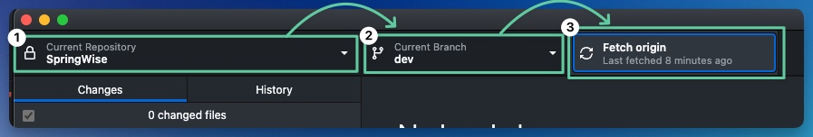
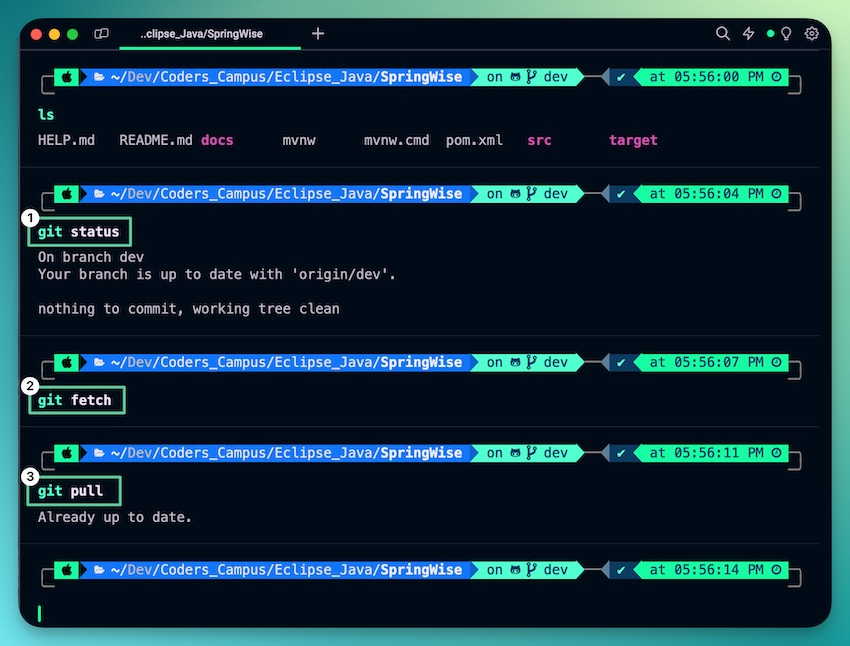
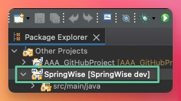
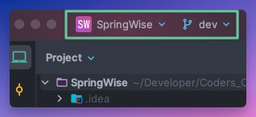

# Setting up SpringWise

To set up SpringWise on your computer, follow these guidelines:

- Use GitHub Desktop and your preferred IDE, or
- Use Terminal/Git BASH with your IDE.

_Choose the method you're most comfortable with to get SpringWise operational._

## Step 1: Get the SpringWise dev branch

---

### GitHub Desktop Instructions

1. Open **GitHub Desktop**
2. Ensure the `Current Repository` is **SpringWise**, if not click the drop down and select the **SpringWise** repository
3. Ensure `Current Branch` is the **dev** branch
4. Click **Fetch origin**
5. If you see Pull, after pressing Fetch origin, then click **Pull**.
6. Open IDE of choice



### Terminal/Git BASH Instructions

- cd into **SpringWise** project folder and type the following git commands into your Terminal/Git BASH
```shell
git status
```
```shell
git fetch
```
```shell
git pull
```
- Open IDE of choice





## Step 2: Open SpringWise app and run it locally

---

### Eclipse IDE Instructions

1. Navigate or open to SpringWise application, inside of **Eclipse IDE**
2. Right click on root folder of SpringWise and click **Refresh**
3. `[SpringWise dev]` should appear to the right of your SpringWise project
4. Navigate to [localhost:8080](localhost:8080) in your browser of choice, we suggest Google Chrome, and ensure it's running successfully



### IntelliJ IDEA Instructions

1. Navigate or open the SpringWise application, inside of **IntelliJ IDEA**
2. Ensure that you see the **dev** branch selected
3. Navigate to [localhost:8080](localhost:8080) in your browser of choice, we suggest Google Chrome, and ensure it's running successfully




## Issues
Encounter any setup issues with SpringWise? Direct message Dave Naugler to resolve them. We'll set some time aside to get the issue resolved outside of regularly scheduled meetings.


