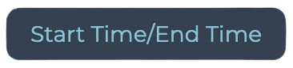

# New UI Template

_03/08/2024 - Kevin Gallaccio_
***

> This document will reference all components to be used in HTML sections of the `cp` app.


## Table of content:

- [HTML page](#html-page-template)
    * [Standard page](#standard-page)
    * [Landing page](#landing-page)
    * [Sidebar page](#sidebar-page)


- [Components](#components)
    * [Tables](#tables)
    * [Forms](#forms)
    * [Form fields](#form-fields)
        * [input fields](#input-fields)
        * [text area](#text-area)
        * [checkboxes](#checkboxes)
        * [buttons](#buttons)


- [Colors](#colors)


- [Typography](#typography)
    * [Display](#display)
    * [Headline](#headline)
    * [Title](#title)
    * [Body](#body)

<br>

***
<br>

## HTML Page Template

### Standard page

> Every Page Uses This Identical HTML Template

```HTML
<!DOCTYPE html>
<html xmlns:th="http://thymeleaf.org">
<div th:replace="~{fragments/head :: head(${pageTitle})}"></div>
<body class="ui-background">
<fbauth-element headless>
    <div>
        <header th:replace="~{fragments/header :: header(${activePage})}"></header>
        <div class="ga-content-main">
            <main>

                <!-- * MAIN CONTENT GOES HERE * -->

            </main>
        </div>
        <div th:replace="~{fragments/footer :: footer}"></div>
    </div>
</fbauth-element>
<div th:replace="~{fragments/authscript :: script}"></div>
</body>
</html>
```

### Landing page

> This is a template for a homepage, displaying a message e.g. "**Welcome to coder packaging**"

```HTML
<!DOCTYPE html>
<html xmlns:th="http://thymeleaf.org">
<div th:replace="~{fragments/head :: head(${pageTitle})}"></div>
<body layout="layout-secured">
<fbauth-element>
    <div layout="layout-home">
        <header th:replace="~{fragments/header :: header(${activePage})}"></header>
        <div class="ga-content-main">
            <body class="ui-background">
            <fbauth-element headless>
                <div>
                    <header th:replace="~{fragments/header :: header(${activePage})}">
                    </header>
                    <div class="welcome">
                        <div class="welcome-text display-small-bold-italic">
                            <!-- REPLACE BELOW TEXT -->
                            Welcome to coder packaging
                        </div>
                    </div>
                    <div th:replace="~{fragments/footer :: footer}">
                    </div>
                </div>
                <div th:replace="~{fragments/footer :: footer}"></div>
        </div>
</fbauth-element>
</body>
</html>
```

### Sidebar page

> For pages that include a sidebar, please use this template:

```HTML
<!DOCTYPE html>
<html xmlns:th="http://thymeleaf.org">
<div th:replace="~{fragments/head :: head(${pageTitle})}"></div>
<body class="ui-background">
<fbauth-element headless>
    <div>
        <header th:replace="~{fragments/header :: header(${activePage})}"></header>
        <div layout="layout-sidebar">
            <div class="sidebar-grid-area">
                <section class="ui-panel-title title-small">

                    <!-- * SIDEBAR TITLE GOES HERE * -->

                </section>
                <nav class="ui-panel">
                    <ul class="ui-navbar-nav">

                        <!-- * SIDEBAR CONTENT GOES HERE * -->

                    </ul>
                </nav>
            </div>
            <div class="ga-content-main">
                <main>

                    <!-- * MAIN CONTENT GOES HERE * -->

                </main>
            </div>
            <div th:replace="~{fragments/footer :: footer}"></div>
        </div>
</fbauth-element>

<div th:replace="~{fragments/authscript :: script}"></div>
</body>
</html>
```

<br>

***

## Components

<br>

### Tables:

> This is the template for using tables (see `*/read` for reference)

```HTML 

<div class="ui-table" role="region" tabindex="0">
    <table>
        <thead>
        <tr>
            <th scope="col"><!-- Column 1 Title --></th>
            <th scope="col"><!-- Column 2 Title --></th>
            <th scope="col"><!-- Column 3 Title --></th>
            <th scope="col"><!-- Column 4 Title --></th>
            <th scope="col"><!-- Column 5 Title --></th>
            <th scope="col"><!-- Column 6 Title --></th>
            <th scope="col"><!-- Column 7 Title --></th>
            <th scope="col"><!-- Column 8 Title --></th>
            <th scope="col"><!-- Column 9 Title --></th>
            <th scope="col"><!-- Column 10 Title --></th>
            <th scope="col"><!-- Column 11 Title --></th>
        </tr>
        </thead>
        <tbody>
        <tr <!--th:each=" ENTER THYMELEAF REFERENCE e.g. student: ${students}"-->>
        <td><span <!-- th:text=" ENTER THYMELEAF REFERENCE e.g. ${student.name}"-->></span></td>
        <td><span <!-- th:text=" ENTER THYMELEAF REFERENCE e.g. ${student.name}"-->></span></td>
        <td><span <!-- th:text=" ENTER THYMELEAF REFERENCE e.g. ${student.name}"-->></span></td>
        <td><span <!-- th:text=" ENTER THYMELEAF REFERENCE e.g. ${student.name}"-->></span></td>
        <td><span <!-- th:text=" ENTER THYMELEAF REFERENCE e.g. ${student.name}"-->></span></td>
        <td><span <!-- th:text=" ENTER THYMELEAF REFERENCE e.g. ${student.name}"-->></span></td>
        <td><span <!-- th:text=" ENTER THYMELEAF REFERENCE e.g. ${student.name}"-->></span></td>
        <td><span <!-- th:text=" ENTER THYMELEAF REFERENCE e.g. ${student.name}"-->></span></td>
        <td><span <!-- th:text=" ENTER THYMELEAF REFERENCE e.g. ${student.name}"-->></span></td>
        <td><span <!-- th:text=" ENTER THYMELEAF REFERENCE e.g. ${student.name}"-->></span></td>
        <td><span <!-- th:text=" ENTER THYMELEAF REFERENCE e.g. ${student.name}"-->></span></td>

        <td> <!-- HAMBURGER UPDATE BUTTON BELOW (to be updated to Material UI) -->
            <a th:href="@{/student/update/{studentId}(studentId=${student.id})}"> 
                    <span>
                        <svg xmlns="http://www.w3.org/2000/svg" width="16" height="16" fill="currentColor"
                             class="bi bi-view-list" viewBox="0 0 16 16"> 
                            <path d="M3 4.5h10a2 2 0 0 1 2 2v3a2 2 0 0 1-2 2H3a2 2 0 0 1-2-2v-3a2 2 0 0 1 2-2zm0 1a1 1 0 0 0-1 1v3a1 1 0 0 0 1 1h10a1 1 0 0 0 1-1v-3a1 1 0 0 0-1-1H3zM1 2a.5.5 0 0 1 .5-.5h13a.5.5 0 0 1 0 1h-13A.5.5 0 0 1 1 2zm0 12a.5.5 0 0 1 .5-.5h13a.5.5 0 0 1 0 1h-13A.5.5 0 0 1 1 14z"/>
                        </svg>
                    </span>
            </a>
        </td>
        </tr>
        </tbody>
    </table>
</div>
```

<br>

### Forms:

> All forms should be built using this template

```HTML
<!-- POPULATE action="" ATTRIBUTE BELOW e.g. student/create -->
<form method="post" class="ui-form" action="     ">

    <!-- TO FETCH STUDENT UID: -->
    <input name="uid" type="hidden" id="uid"/>

    <!-- FORM FIELDS GOES HERE -->

    <!-- SUBMIT BUTTON GOES HERE -->

</form>
``` 

<br>

### Form fields

> All fields that can be included in forms

<br>

#### Input fields:


```HTML

<div class="ui-input-field">
    <label class="ui-label">

        <!-- LABEL GOES HERE (e.g. Next Assignment)-->

    </label>
    <div class="ui-text-input">

        <!--
            - type="" attribute can be:
            text, number, email, color, date, datetime-local, file, password etc...
            depending on the value that is expected

            - Replace id="" attribute to the VALUE that should be pre-populated
            if the field should not be pre-populate, remove id="" attribute.
            
            - you can add a custom placeholder="" attribute if no value is
            pre-populated

            - Replace th:field="" by the value that should be submitted
         -->

        <input class="ui-value" type="text" id="display-name" th:field="${student.name}"/>
    </div>
</div>
```

<br>

#### Text area:


```HTML

<div class="ui-input-field">
    <label class="ui-label">

        <!-- LABEL GOES HERE (e.g. Text Area Test:-->

    </label>
    <div class="ui-text-input">

        <!--
            - cols="" and rows="" can be adjusted
            
            - You can customize the placeholder text
            
            - Replace th:field="" by the value that should be submitted 
         -->

        <textarea class="ui-value" cols="20" rows="5"
                  name="comments" placeholder="write something"
                  th:field="${checkin.comments}"></textarea>
    </div>
</div>
```

<br>

#### Checkboxes:


```HTML
<label class="ui-checkbox">
    <!-- Replace th:field="" by the value that should be submitted-->
    <input type="checkbox" th:field="${checkin.blockers}"/>
    <span>
        
    <!-- Enter text here (e.g. I Have a Blocker-->
        
    </span>
</label>
```

#### Buttons:

- Primary buttons:
  <br><br>
   (light mode)
  <br> (dark mode)

> This is the go-to button that needs to be used primarily

```HTML

<button class="ui-nav-item ui-button" type="submit">
    <span>Your Text Here</span>
</button>
```

- Secondary buttons:
  <br><br>
  (light mode)
  <br>(dark mode)

> Secondary buttons need to be used when there are two very different choices

```HTML

<button class="ui-nav-item ui-button-secondary" type="">
    <span>Your Text Here</span>
</button>
```

- Danger buttons:
  <br><br>
  

> "Danger" buttons need to be used to **Stop**, **Delete** or any dangerous prompts
> these have the same color on light and dark modes.

```HTML

<button class="ui-nav-item ui-button-danger" type="submit">
    <span>Your Text Here</span>
</button>
```

<br>

***

## Colors
>CSS variables need to be used inside **stylesheet** (e.g. `background-color: var(--primary);`) or can be added 
> in-line on **HTML pages** (e.g. `<div style="color: var(--secondary);"`)
> 

| Color Name          | CSS variable                 | Light                                                 | Dark                                                 | Usage                                                            |
|---------------------|------------------------------|-------------------------------------------------------|------------------------------------------------------|------------------------------------------------------------------|
| Primary             | `var(--primary)`             |            |            | Used for main text                                               |
| Secondary           | `var(--secondary)`           |          |          | Used for highlighted text                                        |
| Accent              | `var(--accent)`              |             |             | Used for headers backgrounds                                     |
| Background          | `var(--background)`          |         |         | Used for main background                                         |
| Background Accent   | `var(--background-accent)`   |  |  | Used for elevated sections on background                         |
| Gradient            | `var(--gradient)`            |           |           | Used for headlines (in italic)                                   |
| Live Session        | `var(--live-session)`        |             |            | Used indicate live session is on. Also used for "danger" buttons |
| Live Session Accent | `var(--live-session-accent)` |      |     | Same as above but as the accent or background color              |
| Table Even          | `var(--table-even)`          |         |         | Used for even rows in tables. (same as background accent)        |
| Table Odd           | `var(--table-odd)`           |          |          | Used for odd rows in tables.                                     |

<br>

***

## Typography
>All fonts follow [**Material 3** guidelines](https://m3.material.io/styles/typography/type-scale-tokens) for font-size, line-height and letter-spacing
>
> When designing HTML, please add the corresponding class to a tag for example:   
>`<h1 class="headline-medium-bold-italic"></h1>`
>
> You can add as many classes as you wish on in-line HTML:   
> `<h1 class="ui-title display-small-bold"></h1>`
> 
>    Fonts are built responsive for different types of screen as follows:   
>    **Desktop**: 1024px and up   
>    **Tablet**: between 480px and 1024px   
>    **Smartphone**: less than 480px   
>    _feel free to adjust these values in the media queries_
### Display
>Display styles are reserved for **short, important text or numerals.**   
They work best on large screens.


Code: `class="display-small"`


Code: `class="display-small-bold"`


Code: `class="display-small-bold-italic"`

<br>
<br>

### Headline
>Headlines are best-suited for **short, high-emphasis text on smaller screens.**   
These styles can be good for marking primary passages of text or important regions of content.


Code: `class="headline-large"`


Code: `class="headline-large-light"`


Code: `class="display-headline-medium"`


Code: `class="headline-medium-bold-italic"`


Code: `class="headline-medium-thin"`


Code: `class="headline-small"`


Code: `class="headline-small-bold"`


Code: `class="headline-xs"`

<br>
<br>

### Title
>Titles are smaller than headline styles, and should be used for **medium-emphasis text** that remains relatively short.    
> For example, consider using title styles to divide secondary passages of text or secondary regions of content.


Code: `class="title-large"`


Code: `class="title-large-thin"`


<br>
<br>

### Body
>Body styles are used for longer passages of text in the app.


Code: `class="body-large"`


Code: `class="body-large-bold"`


Code: `class="body-medium"`


Code: `class="body-medium-bold"`


Code: `class="body-small"`


